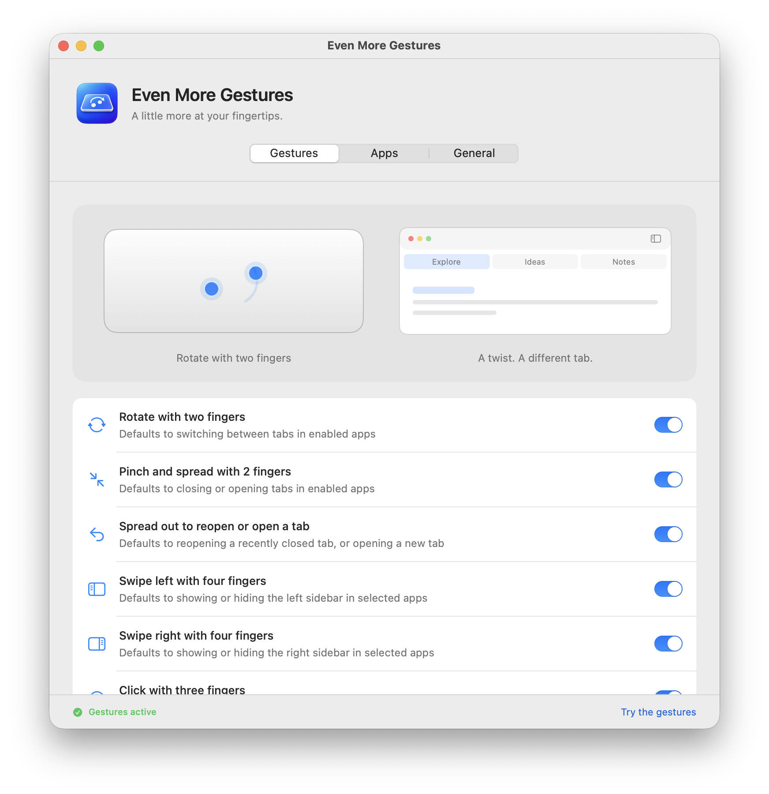
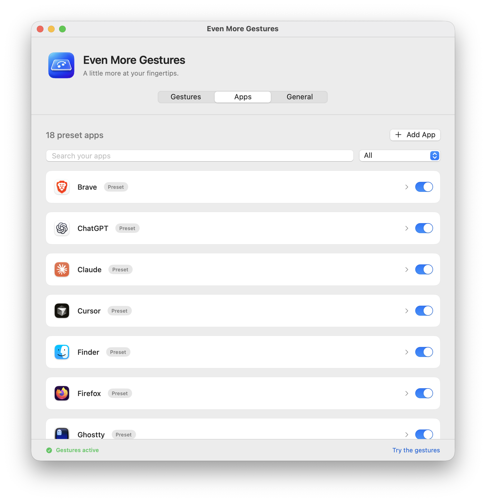
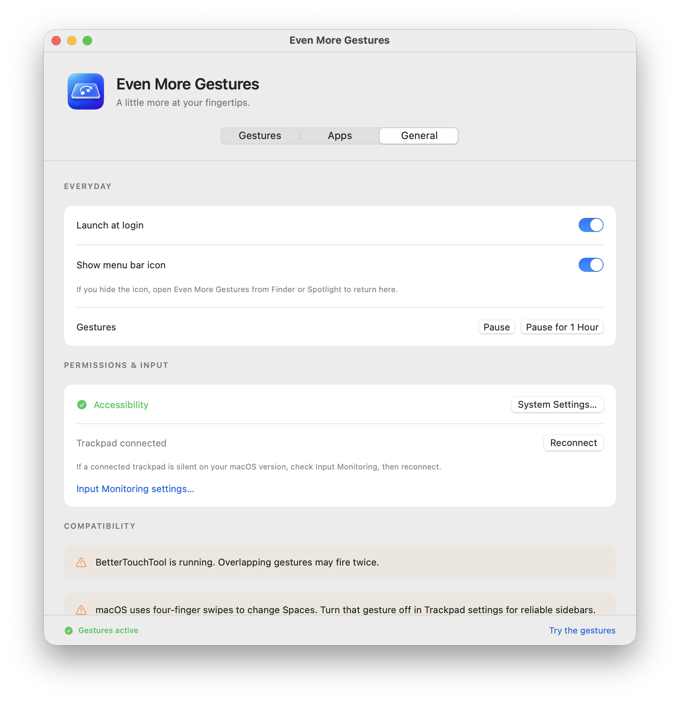

# Even More Gestures

Useful trackpad actions for the Mac apps you already use — already set up for you.

[Download for Mac](https://github.com/parterburn/even-more-gestures/releases/latest/download/Even-More-Gestures.dmg) · [Product page](https://paularterburn.com/even-more-gestures/) · [Release notes](https://github.com/parterburn/even-more-gestures/releases)

> Download the notarized installer, drag the app to Applications, then open it and allow Accessibility access when macOS asks.



Even More Gestures is a small menu-bar app that gives your trackpad a few helpful jobs. Rotate to move between tabs, pinch to close one, spread to open or bring one back, and swipe with four fingers to show a sidebar. It stays out of the Dock and gets out of your way.

| Gesture | What it does |
| --- | --- |
| Two-finger rotate | Switch tabs |
| Two- or three-finger pinch / spread | Close, open, or undo a tab |
| Four-finger swipe | Toggle a left or right sidebar |

## Ready before you change a thing

You do not need to create a shortcut system or set up every app by hand. The app starts with thoughtful defaults for the apps already on your Mac. For example, it can switch Chrome tabs and show its vertical-tabs or Gemini area; show the sidebar in Maps; and reveal either ChatGPT sidebar. You can inspect or change any one of those choices later, but you do not need to.



## One-time setup

Download the [DMG installer](https://github.com/parterburn/even-more-gestures/releases/latest/download/Even-More-Gestures.dmg), drag **Even More Gestures** to **Applications**, then open it and follow the Accessibility setup.

Even More Gestures needs Accessibility permission to activate the commands in your foreground app. The app makes that requirement clear above its main tabs, opens macOS directly to the right settings pane, and explains what to do if macOS has not yet listed it. macOS intentionally requires you to turn that permission on yourself.



## Updates and defaults

The app uses [Sparkle](https://sparkle-project.org/) for signed, automatic app updates. It also checks its signed [defaults feed](docs/defaults/stable.json) at most once per day, with the bundled defaults and the last verified local copy as fallbacks. The feed can update app shortcuts without replacing the app. No accounts, license checks, or install identifiers are used; the defaults endpoint records aggregate request analytics to estimate active installations.

The public update channel lives in the repository at `https://raw.githubusercontent.com/parterburn/even-more-gestures/main/docs/appcast.xml`. Releases must be Developer ID-signed, notarized, and signed with the Sparkle update key before they are added to that feed.

## Pay what feels fair

Even More Gestures is donateware. Gumroad collects payment with its native fair-price checkout, but the app has no license key, activation, support queue, or paid-feature gate. The live [Gumroad page](https://dabbleme.gumroad.com/l/even-more-gestures) uses the three real app screenshots and square thumbnail described in [Documentation/GUMROAD.md](Documentation/GUMROAD.md).

## Build from source

Requires macOS 14 or later, Xcode, and Swift 5.9 or newer.

```sh
REQUIRE_DEVELOPER_ID=1 ./Scripts/build-app.sh
./Scripts/test.sh
```

`Scripts/notarize-app.sh` creates the distribution ZIP after submitting the signed app to Apple’s Notary service. Do not commit credentials or Sparkle private keys.

## Distribution note

This is a direct-download app, not a Mac App Store app: it uses macOS Accessibility APIs and a private multitouch framework to receive trackpad contacts. Every public release is Developer ID-signed and notarized before distribution.

## Sources

Product reference: [Even More Gestures build plan](https://claude.ai/artifact/JTfhgm4prSG7uJzzcyFaVu).

The private multitouch ABI boundary is based on [Calf Trail’s MultitouchSupport header](https://github.com/calftrail/TrackMagic/blob/master/MultitouchSupport.h). [Apple’s AXUIElement documentation](https://developer.apple.com/documentation/applicationservices/axuielement) describes the public Accessibility action surface.
