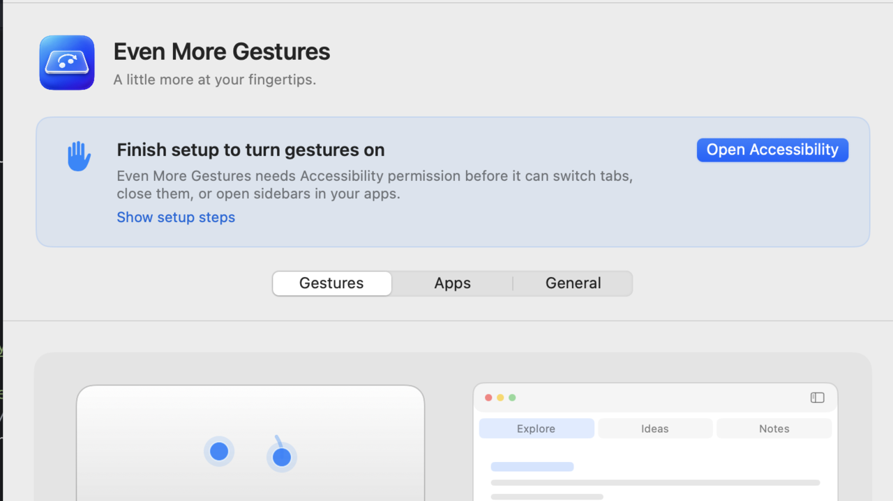
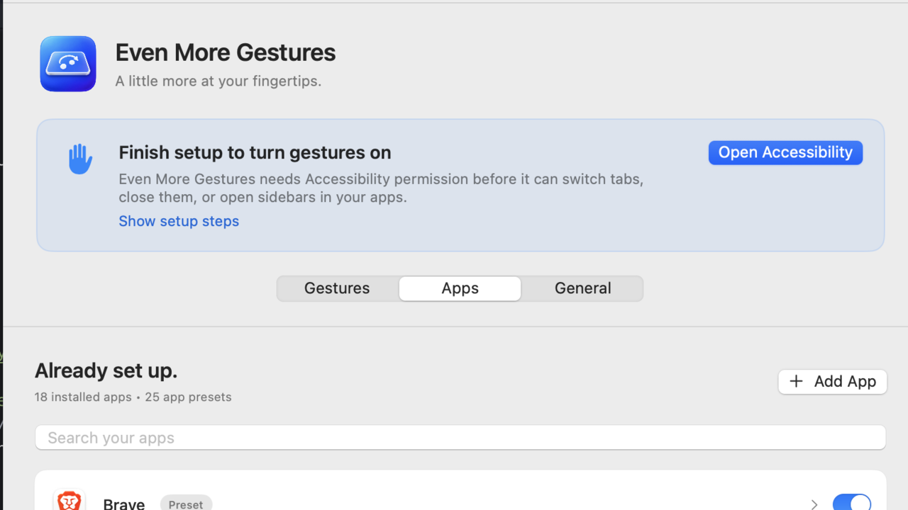
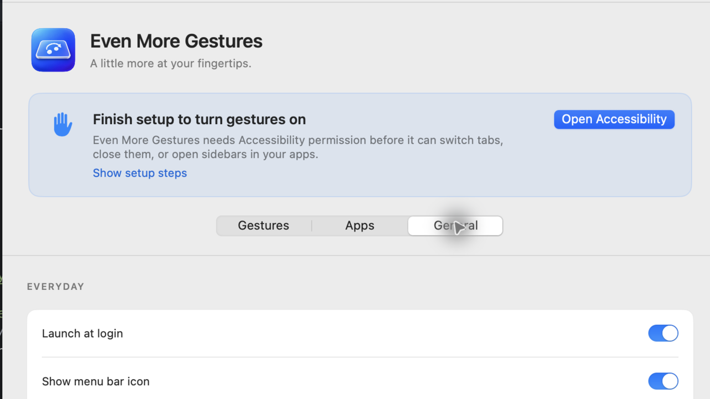

# Even More Gestures

Natural trackpad gestures for tabs and sidebars in the Mac apps you already use.

[Download the latest release](https://github.com/parterburn/even-more-gestures/releases/latest) · [Product page](https://paularterburn.com/even-more-gestures/) · [Release notes](https://github.com/parterburn/even-more-gestures/releases)

> The first public release is being prepared. The link above will always point to the newest notarized ZIP.



Rotate to switch tabs, pinch to close, spread to open or undo, and swipe with four fingers to reveal sidebars. The app runs from the menu bar and never appears in the Dock.

| Gesture | What it does |
| --- | --- |
| Two-finger rotate | Switch tabs |
| Two- or three-finger pinch / spread | Close, open, or undo a tab |
| Four-finger swipe | Toggle a left or right sidebar |

It starts with app-aware defaults and makes the individual shortcuts easy to inspect and change. Current defaults include Maps’ left sidebar (`⌘⌃S`), Chrome vertical tabs (`⌘⇧L`), and ChatGPT’s left/right sidebars (`⌘B` / `⌘⌥B`). Your custom choices always take priority.



## One-time setup

Even More Gestures needs Accessibility permission to activate the commands in your foreground app. The app makes that requirement clear above its main tabs, opens macOS directly to the right settings pane, and explains what to do if macOS has not yet listed it. macOS intentionally requires you to turn that permission on yourself.



## Updates and defaults

The app uses [Sparkle](https://sparkle-project.org/) for signed, automatic app updates. It also checks this repository’s signed [defaults feed](docs/defaults/stable.json) at most once per day, with the bundled defaults and the last verified local copy as fallbacks. The feed can update app shortcuts without replacing the app. No accounts, license checks, analytics, or behavioural telemetry are used.

The public update channel lives at `https://parterburn.github.io/even-more-gestures/appcast.xml`. Releases must be Developer ID-signed, notarized, and signed with the Sparkle update key before they are added to that feed.

## Pay what feels fair

Even More Gestures is donateware. Gumroad collects payment with a fair-price input, but the app has no license key, activation, support queue, or paid-feature gate. The Gumroad listing copy and its three real app screenshots plus square thumbnail are in [Documentation/GUMROAD.md](Documentation/GUMROAD.md).

## Build from source

Requires macOS 14 or later, Xcode, and Swift 5.9 or newer.

```sh
REQUIRE_DEVELOPER_ID=1 ./Scripts/build-app.sh
./Scripts/test.sh
```

`Scripts/notarize-app.sh` creates the distribution ZIP after submitting the signed app to Apple’s Notary service. Do not commit credentials or Sparkle private keys.

## Distribution note

This is a direct-download app, not a Mac App Store app: it uses macOS Accessibility APIs and a private multitouch framework to receive trackpad contacts. Every public release is Developer ID-signed and notarized before distribution.

## Sources

Product reference: [Even More Gestures build plan](https://claude.ai/artifact/JTfhgm4prSG7uJzzcyFaVu).

The private multitouch ABI boundary is based on [Calf Trail’s MultitouchSupport header](https://github.com/calftrail/TrackMagic/blob/master/MultitouchSupport.h). [Apple’s AXUIElement documentation](https://developer.apple.com/documentation/applicationservices/axuielement) describes the public Accessibility action surface.
